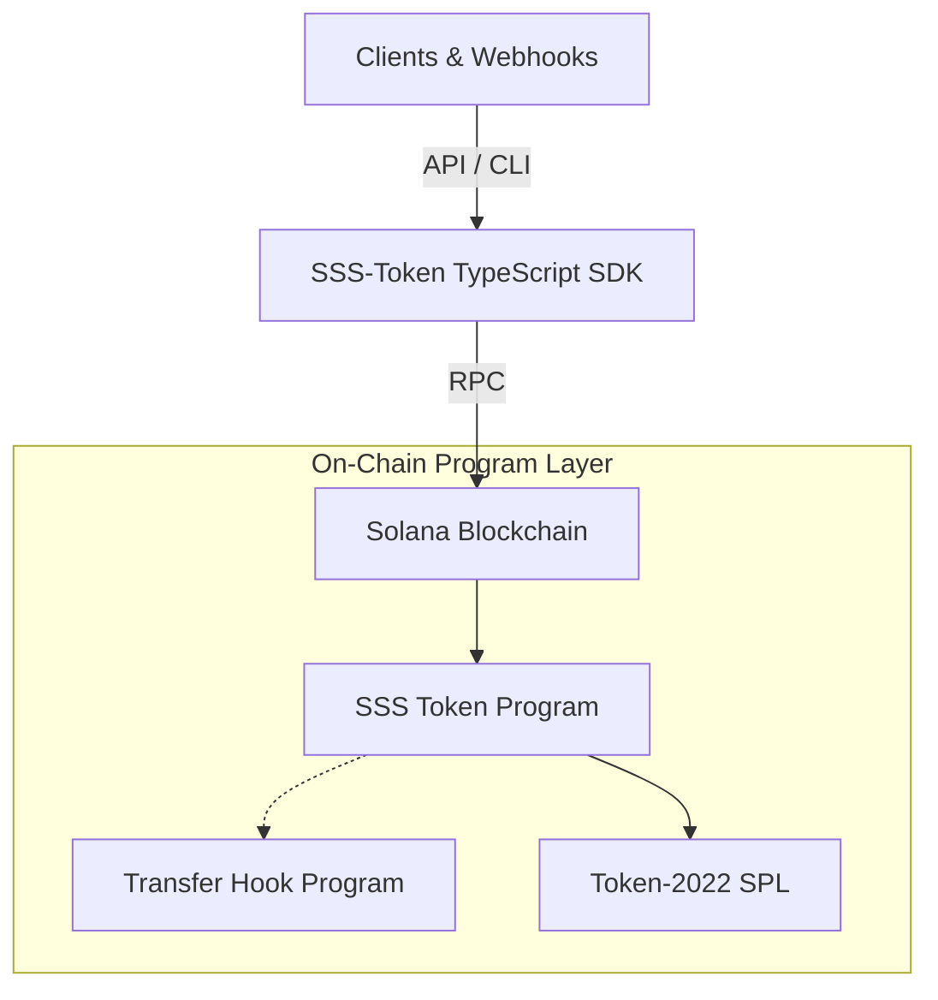

# Solana Stablecoin Standard (SSS)


> The enterprise-grade standard for bootstrapping compliant, frozen-by-default, and hyper-decentralized stablecoins on Solana.

Built for the exact requirements of CBDCs, fiat-pegs (like USDC/USDT equivalents), and internal corporate points.

---

## 🚀 Quick Start

Ensure you have Solana tools and Anchor `0.32.1` installed.

```bash
# Clone the repository
git clone https://github.com/your-username/solana-stablecoin-standard
cd solana-stablecoin-standard

# Install dependencies in the workspace
pnpm install

# Build everything
turbo run build
```

---

## ✨ Features and Presets

The SSS architecture separates behaviors into distinct presets for diverse use-cases. 

- **SSS-1 Preset (Minimalistic)**
  - Minting quotas for multiple administrators
  - Pause and freeze overrides
  - Pure Token-2022 compatability
- **SSS-2 Preset (Compliant)**
  - Full **OFAC / KYC** compliance features
  - Built-in `transfer-hook` validation (Blacklist screening)
  - `seize` capability via Permanent Delegate to retrieve illicit assets
  - Default account frozen state for verified users.

---

## 🏗 Modular Architecture



---

## 📖 Documentation

Find exhaustive deep dives and operational playbooks in the `docs/` folder:

- [ARCHITECTURE](docs/ARCHITECTURE.md)
- [SSS-1 Design Spec](docs/SSS-1.md) 
- [SSS-2 Compliance Spec](docs/SSS-2.md)
- [Compliance Framework](docs/COMPLIANCE.md)
- [API Reference](docs/API.md)
- [SDK Reference](docs/SDK.md)
- [CLI Reference](docs/CLI.md)
- [Operations & Runbook](docs/OPERATIONS.md)

---

## 💻 SDK Example (TypeScript)

Initializing a strictly compliant SSS-2 stablecoin:

```typescript
import { SolanaStablecoin, SSS2_PRESET } from "@stbr/sss-token";

const sdk = new SolanaStablecoin(connection, wallet);

// Deploys the stablecoin config and returns the specific token Mint
const { mint } = await sdk.initialize({
  name: "BRL Coin",
  symbol: "BRLC",
  decimals: 6,
  uri: "https://meta.brlc.com",
  ...SSS2_PRESET
});

// Force seize illicit funds to a treasury
await sdk.seize(mint, illicitAta, treasuryAta, 50_000n);
```

---

## 🙋 Contributing

1. Fork the Project
2. Create your Feature Branch (`git checkout -b feature/AmazingFeature`)
3. Run the end-to-end localnet integrations to verify everything (`anchor test`)
4. Commit your Changes (`git commit -m 'Add some AmazingFeature'`)
5. Push to the Branch (`git push origin feature/AmazingFeature`)
6. Open a Pull Request

## 📄 License

Distributed under the MIT License. See `LICENSE` for more information.
