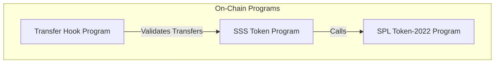
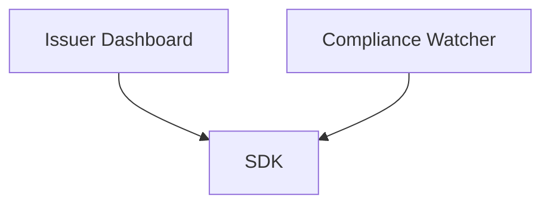

# Architecture Overview

The Solana Stablecoin Standard (SSS) is composed of three main layers, designed for modularity, security, and developer experience.

## 1. On-Chain Programs Layer

We utilize Solana's **Token-2022** standard to leverage native features (like Transfer Hooks, Default Account State, etc.) combined with our custom Anchor programs for administration and compliance.



- **SSS Token Program (`sss-token`)**: Central program holding business logic, PDA derivation, and mint management.
- **Transfer Hook Program (`transfer-hook`)**: Optional plugin enabled by SSS-2. Validates every token transfer against the blacklist.

## 2. Infrastructure & Tooling Layer

This layer interacts directly with the RPC nodes to provide higher-level APIs for developers.

```mermaid
graph LR
    subgraph "Tooling Layer"
        SDK[@stbr/sss-token SDK]
        CLI[sss-token CLI]
    end
    
    SDK --> RPC[Solana RPC]
    CLI --> SDK
```

- **TypeScript SDK**: A strongly-typed wrapper over `@coral-xyz/anchor` and `@solana/spl-token`. Manages PDA derivations natively.
- **CLI**: The command-line interface `sss-token` makes it trivial for operators to freeze, mint, seize, or manage blacklists.

## 3. Application Layer

The final layer that end-users interact with, typically Web3 dashboards, mobile wallets, or backend API services (e.g., Sanctions screeners) that listen to blockchain events to enforce compliance.



## Data Model & PDAs

To minimize rent and enforce security, all configuration is stored in PDAs:

- `StablecoinConfig` (seed: `["stablecoin-config", mint]`)
- `MinterConfig` (seed: `["minter", stablecoin_config, minter_authority]`)
- `BlacklistEntry` (seed: `["blacklist", stablecoin_config, user_address]`)
